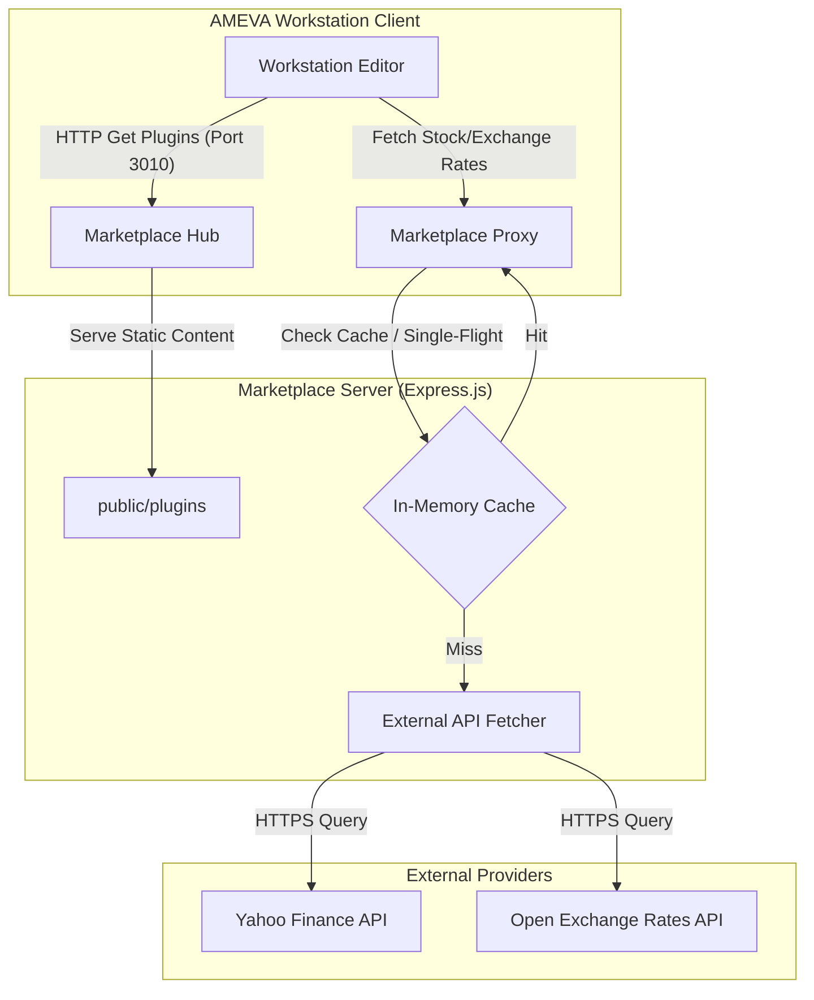

# AMEVA Workstation Marketplace: Integrated Extension & Real-time Financial Data Proxy

> **[프로젝트 요약 (Resume Profile)]**
> 
> * **① 제목:** AMEVA Workstation 인앱 마켓플레이스 및 실시간 금융 데이터 허브
> * **② 주제:** 
>   * 일렉트론(Electron) 기반의 AMEVA Workstation 에코시스템을 지원하는 분산형 확장 플러그인 호스팅 및 실시간 금융 시장 데이터 중계 서버
>   * 야후 파이낸스(Yahoo Finance) 및 오픈 익스체인지 레이트(Open Exchange Rates) API의 요청 폭증과 차단을 우회하기 위한 인메모리 TTL 캐싱 및 Single-Flight 병합 추론 설계
>   * Cross-Origin Resource Sharing(CORS) 표준 정책에 정합하여 안전하고 유연한 로컬/원격 클라이언트 연동 규정 구축
> * **③ 내용요지:**
>   * **사용 기술:** Node.js, Express.js, In-Memory TTL Cache, Single-Flight Coalescing, Yahoo Finance / Open Exchange Rates APIs, CORS
>   * **주요 구성 요소:** Decentralized Plugin Static Server, High-Performance Stock Cache Proxy, Real-Time Exchange Rate Hub, CORS Configured Middleware
>   * **핵심 아키텍처:** Express Router -> Stock / Exchange Rate Controller with TTL Cache & Single-Flight Coalesce -> Static File Delivery (public/plugins)
> * **④ 기여도:** 단독 개발 (100% - 아키텍처 설계 및 코어 API 프록싱 엔진 구현 전담)

---

## 1. 프로젝트 목적 및 필요성

본 프로젝트는 AMEVA Workstation의 분산형 확장 프로그램 배포 자동화를 달성하고, 로컬 에디터에서 실시간으로 필요로 하는 글로벌 금융 시장 및 외환 데이터를 우회 및 병합하여 고속으로 공급하는 전용 분산 서버 구축을 목적으로 합니다. 

대외 금융 API 호출 수 제한(Rate-Limiting) 및 로컬 브라우저의 교차 출처 리소스 공유(CORS) 차단 제약을 극복하고, 클라이언트의 다중 동일 종목 요청 시 네트워크 병목을 해소할 수 있는 고성능 캐싱 게이트웨이를 제공합니다.

---

## 2. 주요 기능 및 연구 목표

* **플러그인 및 템플릿 배포 (Plugin Distribution)**: 마켓플레이스 허브 역할을 수행하여, AMEVA Workstation에서 원클릭으로 주입 가능한 플러그인 파일(`public/plugins/`)을 정적으로 안전하게 배포합니다.
* **고성능 요청 병합 및 캐싱 (High-Performance Caching)**: 인메모리 TTL 캐싱과 동일 요청 단일화(Single-Flight) 패턴을 구현하여, 동일한 티커(Ticker)에 대한 중복적 외부 금융 API 호출을 단일 요청으로 응집해 불필요한 네트워크 트래픽을 방지합니다.
* **실시간 금융 데이터 중계 (Real-Time Financial Hub)**: 야후 파이낸스 및 오픈 익스체인지 레이트 API 프록시 및 한글-티커 매핑(KOREAN_STOCK_DICTIONARY)을 수행하여 클라이언트에 가독성 높은 맞춤형 마켓 정보를 가시화합니다.
* **CORS 교차 출처 제어**: 로컬호스트를 포함한 다양한 원격 일렉트론 렌더러 인스턴스들과의 원활한 동적 통신을 위해 유연하고 안전하게 CORS 정책을 바인딩합니다.

---

## 3. 개요 (Abstract)

AMEVA Workstation Marketplace는 데스크톱 워크스테이션 환경과 밀접하게 연동되는 백엔드 지향적 마이크로서비스 엔진입니다. Node.js Express 프레임워크를 기반으로 하며, 네트워크 비용의 효율성과 데이터 정합성을 목표로 설계되었습니다. 대화형 데이터 요율 제한을 피하기 위한 우회 헤더 프레임 및 캐시 무효화 전략을 정교하게 탑재하여, 안정적인 시장 정보 동기화를 도모합니다.

---

## 4. 시스템 아키텍처 설계 (Software Architecture Design)



---

## 5. 설치 및 구동 가이드

### 요구 사양
- Node.js v18.0.0 이상
- npm v9.0.0 이상

### 설치 및 서버 실행
```bash
git clone https://github.com/uno-km/AMEVA-Workstation-Market-Place.git
cd AMEVA-Workstation-Market-Place
npm install
npm start
```
* 기본적으로 `3010` 포트에서 실행됩니다.

---

## 6. 프로젝트 디렉토리 구조 (Project Structure)
- `server.js`: 캐싱, Single-flight 로직, 금융 데이터 매핑 및 프록시 라우팅을 총괄하는 백엔드 메인 엔트리 포인트.
- `public/plugins/`: AMEVA Workstation에 직접 배포되는 정적 확장 플러그인 및 템플릿 리소스 폴더.
- `package.json`: 애플리케이션 정의 및 의존성 모듈 명세서.
