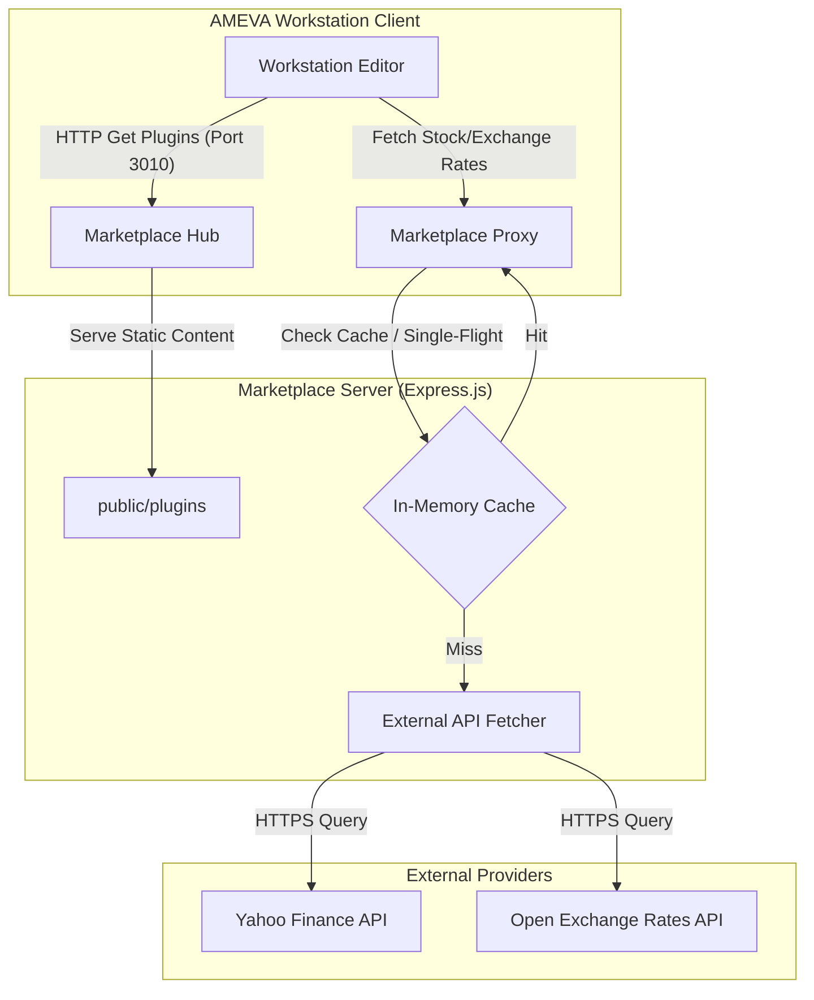

# AMEVA Workstation Marketplace: Integrated Extension & Real-time Financial Data Proxy

> **[프로젝트 요약 (Resume Profile)]**
> 
> * **① 제목:** AMEVA Workstation 인앱 마켓플레이스 및 실시간 금융 데이터 허브
> * **② 주제:** 
>   * 일렉트론(Electron) 기반의 AMEVA Workstation 에코시스템을 지원하는 분산형 확장 플러그인 호스팅 및 실시간 금융 시장 데이터 중계 서버
>   * 야후 파이낸스(Yahoo Finance) 및 오픈 익스체인지 레이트(Open Exchange Rates) API의 요청 폭증과 차단을 우회하기 위한 인메모리 TTL 캐싱 및 Single-Flight 병합 추론 설계
>   * Cross-Origin Resource Sharing(CORS) 표준 정책에 정합하여 안전하고 유연한 로컬/원격 클라이언트 연동 규정 구축
> * **③ 내용요지:**
>   * **사용 기술:** Node.js, Express.js, In-Memory TTL Cache, Single-Flight Coalescing, Yahoo Finance / Open Exchange Rates APIs, CORS
>   * **주요 구성 요소:** Decentralized Plugin Static Server, High-Performance Stock Cache Proxy, Real-Time Exchange Rate Hub, CORS Configured Middleware
>   * **핵심 아키텍처:** Express Router -> Stock / Exchange Rate Controller with TTL Cache & Single-Flight Coalesce -> Static File Delivery (public/plugins)
> * **④ 기여도:** 단독 개발 (100% - 아키텍처 설계 및 코어 API 프록싱 엔진 구현 전담)

---

## 1. 프로젝트 목적 및 필요성

본 프로젝트는 AMEVA Workstation의 분산형 확장 프로그램 배포 자동화를 달성하고, 로컬 에디터에서 실시간으로 필요로 하는 글로벌 금융 시장 및 외환 데이터를 우회 및 병합하여 고속으로 공급하는 전용 분산 서버 구축을 목적으로 합니다. 

대외 금융 API 호출 수 제한(Rate-Limiting) 및 로컬 브라우저의 교차 출처 리소스 공유(CORS) 차단 제약을 극복하고, 클라이언트의 다중 동일 종목 요청 시 네트워크 병목을 해소할 수 있는 고성능 캐싱 게이트웨이를 제공합니다.

---

## 2. 주요 기능 및 연구 목표

* **플러그인 및 템플릿 배포 (Plugin Distribution)**: 마켓플레이스 허브 역할을 수행하여, AMEVA Workstation에서 원클릭으로 주입 가능한 플러그인 파일(`public/plugins/`)을 정적으로 안전하게 배포합니다.
* **고성능 요청 병합 및 캐싱 (High-Performance Caching)**: 인메모리 TTL 캐싱과 동일 요청 단일화(Single-Flight) 패턴을 구현하여, 동일한 티커(Ticker)에 대한 중복적 외부 금융 API 호출을 단일 요청으로 응집해 불필요한 네트워크 트래픽을 방지합니다.
* **실시간 금융 데이터 중계 (Real-Time Financial Hub)**: 야후 파이낸스 및 오픈 익스체인지 레이트 API 프록시 및 한글-티커 매핑(KOREAN_STOCK_DICTIONARY)을 수행하여 클라이언트에 가독성 높은 맞춤형 마켓 정보를 가시화합니다.
* **CORS 교차 출처 제어**: 로컬호스트를 포함한 다양한 원격 일렉트론 렌더러 인스턴스들과의 원활한 동적 통신을 위해 유연하고 안전하게 CORS 정책을 바인딩합니다.

---

## 3. 개요 (Abstract)

AMEVA Workstation Marketplace는 데스크톱 워크스테이션 환경과 밀접하게 연동되는 백엔드 지향적 마이크로서비스 엔진입니다. Node.js Express 프레임워크를 기반으로 하며, 네트워크 비용의 효율성과 데이터 정합성을 목표로 설계되었습니다. 대화형 데이터 요율 제한을 피하기 위한 우회 헤더 프레임 및 캐시 무효화 전략을 정교하게 탑재하여, 안정적인 시장 정보 동기화를 도모합니다.

---

## 4. 시스템 아키텍처 설계 (Software Architecture Design)



---

## 5. 설치 및 구동 가이드

### 요구 사양
- Node.js v18.0.0 이상
- npm v9.0.0 이상

### 설치 및 서버 실행
```bash
git clone https://github.com/uno-km/AMEVA-Workstation-Market-Place.git
cd AMEVA-Workstation-Market-Place
npm install
npm start
```
* 기본적으로 `3010` 포트에서 실행됩니다.

---

## 6. 프로젝트 디렉토리 구조 (Project Structure)
- `server.js`: 캐싱, Single-flight 로직, 금융 데이터 매핑 및 프록시 라우팅을 총괄하는 백엔드 메인 엔트리 포인트.
- `public/plugins/`: AMEVA Workstation에 직접 배포되는 정적 확장 플러그인 및 템플릿 리소스 폴더.
- `package.json`: 애플리케이션 정의 및 의존성 모듈 명세서.
<div align="center">
  <h1>🌟 AMEVA Workstation Marketplace</h1>
  <p><b>AMEVA 워크스테이션 생태계를 위한 공식 확장 프로그램 및 플러그인 마켓플레이스입니다.</b></p>
</div>

---

## 🚀 개요 (Overview)

**AMEVA 마켓플레이스**는 워크스테이션의 생산성을 극대화하기 위한 다양한 확장 기능과 유틸리티, 그리고 실시간 금융 데이터를 제공하는 중앙 허브입니다. 사용자는 별도의 복잡한 설치 없이 마켓플레이스에 접속하여 필요한 기능을 즉시 활성화하고 사용할 수 있습니다.

## 🛍️ 확장 기능 스토어 (Extensions Store)

> 아래 목록은 마켓플레이스에서 현재 실시간으로 서비스 중인 최신 기능들입니다. 새로운 기능이 릴리즈되면 스토어 목록에 자동으로 업데이트됩니다.

### 🛠️ 스탠다드 에디션 (Standard Plugins)
AMEVA 워크스테이션 환경을 한층 더 쾌적하게 만들어 주는 핵심 생산성 도구 및 기본 유틸리티 모음입니다.

<table>
  <thead>
    <tr>
      <th width="12%" align="center">Preview</th>
      <th width="28%">Product Name</th>
      <th width="60%">Features & Benefits</th>
    </tr>
  </thead>
  <tbody>
    <tr>
      <td align="center">
        <br/>
        <span style="font-size: 1.5rem;">🧮</span>
      </td>
      <td>
        <b style="font-size: 1.1em; color: #2c3e50;">Smart Calculator</b><br/><br/>
        
      </td>
      <td>
        문서 작업의 흐름을 끊지 않고 즉석에서 복잡한 수식을 계산할 수 있는 스마트 도우미입니다.<br/><br/>
        <blockquote style="margin: 0; padding-left: 10px; border-left: 4px solid #007bff; color: #6c757d; font-size: 0.9em;">✨ 클라우드 스트리밍을 통한 1-Click 즉시 활성화 지원</blockquote>
      </td>
    </tr>
    <tr>
      <td align="center">
        <br/>
        <span style="font-size: 1.5rem;">📅</span>
      </td>
      <td>
        <b style="font-size: 1.1em; color: #2c3e50;">Smart Scheduler</b><br/><br/>
        
      </td>
      <td>
        프로젝트 일정과 문서 작업 데드라인을 직관적으로 연동하고 관리할 수 있는 맞춤형 스마트 스케줄러입니다.<br/><br/>
        <blockquote style="margin: 0; padding-left: 10px; border-left: 4px solid #007bff; color: #6c757d; font-size: 0.9em;">✨ 클라우드 스트리밍을 통한 1-Click 즉시 활성화 지원</blockquote>
      </td>
    </tr>
    <tr>
      <td align="center">
        <br/>
        <span style="font-size: 1.5rem;">🤝</span>
      </td>
      <td>
        <b style="font-size: 1.1em; color: #2c3e50;">Live Team Collaboration</b><br/><br/>
        
      </td>
      <td>
        시공간의 제약을 뛰어넘어, 강력한 보안 중앙 채널을 통해 팀원들과 문서를 실시간으로 동시 편집할 수 있는 엔터프라이즈급 협업 솔루션입니다.<br/><br/>
        <blockquote style="margin: 0; padding-left: 10px; border-left: 4px solid #007bff; color: #6c757d; font-size: 0.9em;">✨ 클라우드 스트리밍을 통한 1-Click 즉시 활성화 지원</blockquote>
      </td>
    </tr>
    <tr>
      <td align="center">
        <br/>
        <span style="font-size: 1.5rem;">✨</span>
      </td>
      <td>
        <b style="font-size: 1.1em; color: #2c3e50;">Db-explorer</b><br/><br/>
        
      </td>
      <td>
        마켓플레이스에 새로 런칭된 최신 확장팩입니다.<br/><br/>
        <blockquote style="margin: 0; padding-left: 10px; border-left: 4px solid #007bff; color: #6c757d; font-size: 0.9em;">✨ 클라우드 스트리밍을 통한 1-Click 즉시 활성화 지원</blockquote>
      </td>
    </tr>
    <tr>
      <td align="center">
        <br/>
        <span style="font-size: 1.5rem;">🖍️</span>
      </td>
      <td>
        <b style="font-size: 1.1em; color: #2c3e50;">Whiteboard Canvas</b><br/><br/>
        
      </td>
      <td>
        글로 표현하기 어려운 복잡한 아이디어를 문서 중간에 즉각적으로 스케치하고 드로잉할 수 있는 무한 캔버스 보드입니다.<br/><br/>
        <blockquote style="margin: 0; padding-left: 10px; border-left: 4px solid #007bff; color: #6c757d; font-size: 0.9em;">✨ 클라우드 스트리밍을 통한 1-Click 즉시 활성화 지원</blockquote>
      </td>
    </tr>
    <tr>
      <td align="center">
        <br/>
        <span style="font-size: 1.5rem;">✨</span>
      </td>
      <td>
        <b style="font-size: 1.1em; color: #2c3e50;">Finance-dashboard</b><br/><br/>
        
      </td>
      <td>
        마켓플레이스에 새로 런칭된 최신 확장팩입니다.<br/><br/>
        <blockquote style="margin: 0; padding-left: 10px; border-left: 4px solid #007bff; color: #6c757d; font-size: 0.9em;">✨ 클라우드 스트리밍을 통한 1-Click 즉시 활성화 지원</blockquote>
      </td>
    </tr>
    <tr>
      <td align="center">
        <br/>
        <span style="font-size: 1.5rem;">☁️</span>
      </td>
      <td>
        <b style="font-size: 1.1em; color: #2c3e50;">Google Drive Cloud Sync</b><br/><br/>
        
      </td>
      <td>
        소중한 작업 데이터를 구글 드라이브 클라우드에 원클릭으로 직접 백업하고 실시간 동기화하여 유실을 원천 차단합니다.<br/><br/>
        <blockquote style="margin: 0; padding-left: 10px; border-left: 4px solid #007bff; color: #6c757d; font-size: 0.9em;">✨ 클라우드 스트리밍을 통한 1-Click 즉시 활성화 지원</blockquote>
      </td>
    </tr>
    <tr>
      <td align="center">
        <br/>
        <span style="font-size: 1.5rem;">✨</span>
      </td>
      <td>
        <b style="font-size: 1.1em; color: #2c3e50;">Google-maps</b><br/><br/>
        
      </td>
      <td>
        마켓플레이스에 새로 런칭된 최신 확장팩입니다.<br/><br/>
        <blockquote style="margin: 0; padding-left: 10px; border-left: 4px solid #007bff; color: #6c757d; font-size: 0.9em;">✨ 클라우드 스트리밍을 통한 1-Click 즉시 활성화 지원</blockquote>
      </td>
    </tr>
    <tr>
      <td align="center">
        <br/>
        <span style="font-size: 1.5rem;">🔍</span>
      </td>
      <td>
        <b style="font-size: 1.1em; color: #2c3e50;">Google Stealth Search</b><br/><br/>
        
      </td>
      <td>
        검색 기록을 남기지 않는 안전한 임시 프라이버시 세션을 통해, 즉석에서 구글 검색을 활용할 수 있는 스텔스 브라우저입니다.<br/><br/>
        <blockquote style="margin: 0; padding-left: 10px; border-left: 4px solid #007bff; color: #6c757d; font-size: 0.9em;">✨ 클라우드 스트리밍을 통한 1-Click 즉시 활성화 지원</blockquote>
      </td>
    </tr>
    <tr>
      <td align="center">
        <br/>
        <span style="font-size: 1.5rem;">✨</span>
      </td>
      <td>
        <b style="font-size: 1.1em; color: #2c3e50;">Mind-map</b><br/><br/>
        
      </td>
      <td>
        마켓플레이스에 새로 런칭된 최신 확장팩입니다.<br/><br/>
        <blockquote style="margin: 0; padding-left: 10px; border-left: 4px solid #007bff; color: #6c757d; font-size: 0.9em;">✨ 클라우드 스트리밍을 통한 1-Click 즉시 활성화 지원</blockquote>
      </td>
    </tr>
    <tr>
      <td align="center">
        <br/>
        <span style="font-size: 1.5rem;">🗺️</span>
      </td>
      <td>
        <b style="font-size: 1.1em; color: #2c3e50;">Document Minimap</b><br/><br/>
        
      </td>
      <td>
        방대한 문서의 전체 윤곽을 한눈에 파악하고 원하는 위치로 빠르게 이동할 수 있는 우측 미니맵 뷰어를 제공합니다.<br/><br/>
        <blockquote style="margin: 0; padding-left: 10px; border-left: 4px solid #007bff; color: #6c757d; font-size: 0.9em;">✨ 클라우드 스트리밍을 통한 1-Click 즉시 활성화 지원</blockquote>
      </td>
    </tr>
    <tr>
      <td align="center">
        <br/>
        <span style="font-size: 1.5rem;">📗</span>
      </td>
      <td>
        <b style="font-size: 1.1em; color: #2c3e50;">Naver Portal Viewer</b><br/><br/>
        
      </td>
      <td>
        브라우저 창을 넘나들 필요 없이 워크스테이션 내부에서 안전하게 네이버 서비스를 이용할 수 있는 내장형 포털 뷰어입니다.<br/><br/>
        <blockquote style="margin: 0; padding-left: 10px; border-left: 4px solid #007bff; color: #6c757d; font-size: 0.9em;">✨ 클라우드 스트리밍을 통한 1-Click 즉시 활성화 지원</blockquote>
      </td>
    </tr>
    <tr>
      <td align="center">
        <br/>
        <span style="font-size: 1.5rem;">📑</span>
      </td>
      <td>
        <b style="font-size: 1.1em; color: #2c3e50;">TOC Navigator</b><br/><br/>
        
      </td>
      <td>
        문서 내 제목(Heading) 구조를 자동으로 분석하여 좌측에 직관적인 트리 형태의 목차(TOC) 네비게이션을 구축합니다.<br/><br/>
        <blockquote style="margin: 0; padding-left: 10px; border-left: 4px solid #007bff; color: #6c757d; font-size: 0.9em;">✨ 클라우드 스트리밍을 통한 1-Click 즉시 활성화 지원</blockquote>
      </td>
    </tr>
    <tr>
      <td align="center">
        <br/>
        <span style="font-size: 1.5rem;">✨</span>
      </td>
      <td>
        <b style="font-size: 1.1em; color: #2c3e50;">Pdf-rag</b><br/><br/>
        
      </td>
      <td>
        마켓플레이스에 새로 런칭된 최신 확장팩입니다.<br/><br/>
        <blockquote style="margin: 0; padding-left: 10px; border-left: 4px solid #007bff; color: #6c757d; font-size: 0.9em;">✨ 클라우드 스트리밍을 통한 1-Click 즉시 활성화 지원</blockquote>
      </td>
    </tr>
    <tr>
      <td align="center">
        <br/>
        <span style="font-size: 1.5rem;">✨</span>
      </td>
      <td>
        <b style="font-size: 1.1em; color: #2c3e50;">Pomodoro</b><br/><br/>
        
      </td>
      <td>
        마켓플레이스에 새로 런칭된 최신 확장팩입니다.<br/><br/>
        <blockquote style="margin: 0; padding-left: 10px; border-left: 4px solid #007bff; color: #6c757d; font-size: 0.9em;">✨ 클라우드 스트리밍을 통한 1-Click 즉시 활성화 지원</blockquote>
      </td>
    </tr>
    <tr>
      <td align="center">
        <br/>
        <span style="font-size: 1.5rem;">✨</span>
      </td>
      <td>
        <b style="font-size: 1.1em; color: #2c3e50;">Presentation</b><br/><br/>
        
      </td>
      <td>
        마켓플레이스에 새로 런칭된 최신 확장팩입니다.<br/><br/>
        <blockquote style="margin: 0; padding-left: 10px; border-left: 4px solid #007bff; color: #6c757d; font-size: 0.9em;">✨ 클라우드 스트리밍을 통한 1-Click 즉시 활성화 지원</blockquote>
      </td>
    </tr>
    <tr>
      <td align="center">
        <br/>
        <span style="font-size: 1.5rem;">✨</span>
      </td>
      <td>
        <b style="font-size: 1.1em; color: #2c3e50;">Rest-client</b><br/><br/>
        
      </td>
      <td>
        마켓플레이스에 새로 런칭된 최신 확장팩입니다.<br/><br/>
        <blockquote style="margin: 0; padding-left: 10px; border-left: 4px solid #007bff; color: #6c757d; font-size: 0.9em;">✨ 클라우드 스트리밍을 통한 1-Click 즉시 활성화 지원</blockquote>
      </td>
    </tr>
    <tr>
      <td align="center">
        <br/>
        <span style="font-size: 1.5rem;">🎨</span>
      </td>
      <td>
        <b style="font-size: 1.1em; color: #2c3e50;">Rich Text Studio</b><br/><br/>
        
      </td>
      <td>
        단조로운 텍스트를 넘어, 글꼴, 크기, 색상 등 풍부한 타이포그래피 서식을 자유롭게 적용할 수 있는 강력한 스타일링 툴바입니다.<br/><br/>
        <blockquote style="margin: 0; padding-left: 10px; border-left: 4px solid #007bff; color: #6c757d; font-size: 0.9em;">✨ 클라우드 스트리밍을 통한 1-Click 즉시 활성화 지원</blockquote>
      </td>
    </tr>
    <tr>
      <td align="center">
        <br/>
        <span style="font-size: 1.5rem;">✨</span>
      </td>
      <td>
        <b style="font-size: 1.1em; color: #2c3e50;">Voice-dictation</b><br/><br/>
        
      </td>
      <td>
        마켓플레이스에 새로 런칭된 최신 확장팩입니다.<br/><br/>
        <blockquote style="margin: 0; padding-left: 10px; border-left: 4px solid #007bff; color: #6c757d; font-size: 0.9em;">✨ 클라우드 스트리밍을 통한 1-Click 즉시 활성화 지원</blockquote>
      </td>
    </tr>
    <tr>
      <td align="center">
        <br/>
        <span style="font-size: 1.5rem;">✨</span>
      </td>
      <td>
        <b style="font-size: 1.1em; color: #2c3e50;">Web-browser</b><br/><br/>
        
      </td>
      <td>
        마켓플레이스에 새로 런칭된 최신 확장팩입니다.<br/><br/>
        <blockquote style="margin: 0; padding-left: 10px; border-left: 4px solid #007bff; color: #6c757d; font-size: 0.9em;">✨ 클라우드 스트리밍을 통한 1-Click 즉시 활성화 지원</blockquote>
      </td>
    </tr>
    <tr>
      <td align="center">
        <br/>
        <span style="font-size: 1.5rem;">✨</span>
      </td>
      <td>
        <b style="font-size: 1.1em; color: #2c3e50;">Wireframe</b><br/><br/>
        
      </td>
      <td>
        마켓플레이스에 새로 런칭된 최신 확장팩입니다.<br/><br/>
        <blockquote style="margin: 0; padding-left: 10px; border-left: 4px solid #007bff; color: #6c757d; font-size: 0.9em;">✨ 클라우드 스트리밍을 통한 1-Click 즉시 활성화 지원</blockquote>
      </td>
    </tr>
    <tr>
      <td align="center">
        <br/>
        <span style="font-size: 1.5rem;">📺</span>
      </td>
      <td>
        <b style="font-size: 1.1em; color: #2c3e50;">YouTube PiP Player</b><br/><br/>
        
      </td>
      <td>
        작업 중인 문서 화면을 가리지 않으면서, 멀티태스킹이 가능한 PIP(Picture-in-Picture) 팝업 형태의 유튜브 플레이어를 지원합니다.<br/><br/>
        <blockquote style="margin: 0; padding-left: 10px; border-left: 4px solid #007bff; color: #6c757d; font-size: 0.9em;">✨ 클라우드 스트리밍을 통한 1-Click 즉시 활성화 지원</blockquote>
      </td>
    </tr>
  </tbody>
</table>


### 💎 엔터프라이즈 에디션 (Premium Plugins)
복잡한 비즈니스 로직 처리, 실시간 금융 인프라 연동 및 고급 AI 분석 기능을 제공하는 프리미엄 확장팩입니다.

<table>
  <thead>
    <tr>
      <th width="12%" align="center">Preview</th>
      <th width="28%">Product Name</th>
      <th width="60%">Features & Benefits</th>
    </tr>
  </thead>
  <tbody>
    <tr>
      <td align="center">
        <br/>
        <span style="font-size: 1.5rem;">🌐</span>
      </td>
      <td>
        <b style="font-size: 1.1em; color: #2c3e50;">Ameva In-App Browser</b><br/><br/>
        
      </td>
      <td>
        별도의 외부 브라우저 없이도 모든 웹 서핑과 자료 조사를 에디터 내부에서 끝낼 수 있는 초고속 통합형 웹 브라우저입니다.<br/><br/>
        <blockquote style="margin: 0; padding-left: 10px; border-left: 4px solid #ff69b4; color: #6c757d; font-size: 0.9em;">✨ 클라우드 스트리밍을 통한 1-Click 즉시 활성화 지원</blockquote>
      </td>
    </tr>
    <tr>
      <td align="center">
        <br/>
        <span style="font-size: 1.5rem;">🗄️</span>
      </td>
      <td>
        <b style="font-size: 1.1em; color: #2c3e50;">Database Inspector</b><br/><br/>
        
      </td>
      <td>
        서버에 내장된 데이터베이스의 구조와 테이블을 즉석에서 탐색하고 쿼리를 테스트해 볼 수 있는 개발자용 인스펙터입니다.<br/><br/>
        <blockquote style="margin: 0; padding-left: 10px; border-left: 4px solid #ff69b4; color: #6c757d; font-size: 0.9em;">✨ 클라우드 스트리밍을 통한 1-Click 즉시 활성화 지원</blockquote>
      </td>
    </tr>
    <tr>
      <td align="center">
        <br/>
        <span style="font-size: 1.5rem;">📈</span>
      </td>
      <td>
        <b style="font-size: 1.1em; color: #2c3e50;">Global Finance & Exchange</b><br/><br/>
        
      </td>
      <td>
        전 세계 주요 주식 시장 지수, 실시간 환율(VND 포함), 금리 현황을 한 곳에서 모니터링할 수 있는 전문가용 금융 대시보드입니다.<br/><br/>
        <blockquote style="margin: 0; padding-left: 10px; border-left: 4px solid #ff69b4; color: #6c757d; font-size: 0.9em;">✨ 클라우드 스트리밍을 통한 1-Click 즉시 활성화 지원</blockquote>
      </td>
    </tr>
    <tr>
      <td align="center">
        <br/>
        <span style="font-size: 1.5rem;">📍</span>
      </td>
      <td>
        <b style="font-size: 1.1em; color: #2c3e50;">Google Maps Integrator</b><br/><br/>
        
      </td>
      <td>
        문서 내에 특정 장소를 검색하여 첨부하거나, 전 세계의 지도를 자유롭게 탐색할 수 있는 구글 지도 연동형 뷰어입니다.<br/><br/>
        <blockquote style="margin: 0; padding-left: 10px; border-left: 4px solid #ff69b4; color: #6c757d; font-size: 0.9em;">✨ 클라우드 스트리밍을 통한 1-Click 즉시 활성화 지원</blockquote>
      </td>
    </tr>
    <tr>
      <td align="center">
        <br/>
        <span style="font-size: 1.5rem;">📋</span>
      </td>
      <td>
        <b style="font-size: 1.1em; color: #2c3e50;">Agile Kanban Board</b><br/><br/>
        
      </td>
      <td>
        업무 진행 상황(To-Do, In Progress, Done)을 시각적인 카드로 관리하여 애자일한 팀 생산성을 끌어올리는 칸반 솔루션입니다.<br/><br/>
        <blockquote style="margin: 0; padding-left: 10px; border-left: 4px solid #ff69b4; color: #6c757d; font-size: 0.9em;">✨ 클라우드 스트리밍을 통한 1-Click 즉시 활성화 지원</blockquote>
      </td>
    </tr>
    <tr>
      <td align="center">
        <br/>
        <span style="font-size: 1.5rem;">🧠</span>
      </td>
      <td>
        <b style="font-size: 1.1em; color: #2c3e50;">Idea Mind Mapper</b><br/><br/>
        
      </td>
      <td>
        머릿속의 파편화된 아이디어와 개념들을 시각적인 노드와 링크로 연결하여 구조화할 수 있는 브레인스토밍 도구입니다.<br/><br/>
        <blockquote style="margin: 0; padding-left: 10px; border-left: 4px solid #ff69b4; color: #6c757d; font-size: 0.9em;">✨ 클라우드 스트리밍을 통한 1-Click 즉시 활성화 지원</blockquote>
      </td>
    </tr>
    <tr>
      <td align="center">
        <br/>
        <span style="font-size: 1.5rem;">📄</span>
      </td>
      <td>
        <b style="font-size: 1.1em; color: #2c3e50;">AI PDF Analyst (RAG)</b><br/><br/>
        
      </td>
      <td>
        수백 페이지에 달하는 방대한 PDF 논문이나 매뉴얼을 로드하고, AI 기술을 통해 즉각적인 요약과 질의응답을 수행하는 지식 분석 툴입니다.<br/><br/>
        <blockquote style="margin: 0; padding-left: 10px; border-left: 4px solid #ff69b4; color: #6c757d; font-size: 0.9em;">✨ 클라우드 스트리밍을 통한 1-Click 즉시 활성화 지원</blockquote>
      </td>
    </tr>
    <tr>
      <td align="center">
        <br/>
        <span style="font-size: 1.5rem;">🍅</span>
      </td>
      <td>
        <b style="font-size: 1.1em; color: #2c3e50;">Pomodoro Focus Timer</b><br/><br/>
        
      </td>
      <td>
        집중과 휴식의 황금 비율(25분/5분)을 통해 사용자의 작업 효율을 극대화하고 번아웃을 예방하는 뽀모도로 타이머입니다.<br/><br/>
        <blockquote style="margin: 0; padding-left: 10px; border-left: 4px solid #ff69b4; color: #6c757d; font-size: 0.9em;">✨ 클라우드 스트리밍을 통한 1-Click 즉시 활성화 지원</blockquote>
      </td>
    </tr>
    <tr>
      <td align="center">
        <br/>
        <span style="font-size: 1.5rem;">📽️</span>
      </td>
      <td>
        <b style="font-size: 1.1em; color: #2c3e50;">Markdown Presenter</b><br/><br/>
        
      </td>
      <td>
        작성된 마크다운 문서를 별도의 PPT 변환 과정 없이, 단 1초 만에 화려한 발표용 슬라이드 모드로 전환해 주는 프레젠터입니다.<br/><br/>
        <blockquote style="margin: 0; padding-left: 10px; border-left: 4px solid #ff69b4; color: #6c757d; font-size: 0.9em;">✨ 클라우드 스트리밍을 통한 1-Click 즉시 활성화 지원</blockquote>
      </td>
    </tr>
    <tr>
      <td align="center">
        <br/>
        <span style="font-size: 1.5rem;">🔌</span>
      </td>
      <td>
        <b style="font-size: 1.1em; color: #2c3e50;">API Testing Studio</b><br/><br/>
        
      </td>
      <td>
        API 개발 및 검증을 위해, 포스트맨(Postman)과 같이 HTTP/REST 요청을 보내고 응답을 테스트할 수 있는 내장형 클라이언트입니다.<br/><br/>
        <blockquote style="margin: 0; padding-left: 10px; border-left: 4px solid #ff69b4; color: #6c757d; font-size: 0.9em;">✨ 클라우드 스트리밍을 통한 1-Click 즉시 활성화 지원</blockquote>
      </td>
    </tr>
    <tr>
      <td align="center">
        <br/>
        <span style="font-size: 1.5rem;">🎙️</span>
      </td>
      <td>
        <b style="font-size: 1.1em; color: #2c3e50;">AI Voice Dictation</b><br/><br/>
        
      </td>
      <td>
        타이핑할 필요 없이 말하는 즉시 AI가 고정밀 STT 기술로 음성을 인식하여 텍스트로 자동 변환해 주는 딕테이션 툴입니다.<br/><br/>
        <blockquote style="margin: 0; padding-left: 10px; border-left: 4px solid #ff69b4; color: #6c757d; font-size: 0.9em;">✨ 클라우드 스트리밍을 통한 1-Click 즉시 활성화 지원</blockquote>
      </td>
    </tr>
    <tr>
      <td align="center">
        <br/>
        <span style="font-size: 1.5rem;">📐</span>
      </td>
      <td>
        <b style="font-size: 1.1em; color: #2c3e50;">UI/UX Wireframer</b><br/><br/>
        
      </td>
      <td>
        웹/앱 기획 단계에서 신속하게 UI 레이아웃을 스케치하고 프로토타입을 설계할 수 있는 전문가용 와이어프레이밍 툴입니다.<br/><br/>
        <blockquote style="margin: 0; padding-left: 10px; border-left: 4px solid #ff69b4; color: #6c757d; font-size: 0.9em;">✨ 클라우드 스트리밍을 통한 1-Click 즉시 활성화 지원</blockquote>
      </td>
    </tr>
  </tbody>
</table>


## ⚡ 주요 특징 (Key Features)

- **즉시 활성화 (Zero-Install)**: 마켓플레이스의 모든 기능은 로컬 시스템에 무거운 패키지를 설치할 필요 없이 클라우드를 통해 즉각적으로 스트리밍되어 적용됩니다.
- **실시간 금융 인프라 (Real-Time Hub)**: 글로벌 주식, 환율 등의 복잡한 금융 데이터를 지연 없이 실시간으로 집계하여 대시보드에 끊김 없이 제공합니다.
- **자동 동기화 (Auto Sync)**: 중앙 서버에서 기능이 업데이트되면, 사용자의 워크스테이션에도 즉시 최신 버전의 기능이 동기화됩니다.

---

<div align="center">
  <p><b>Proprietary License. All rights reserved.</b></p>
</div>
